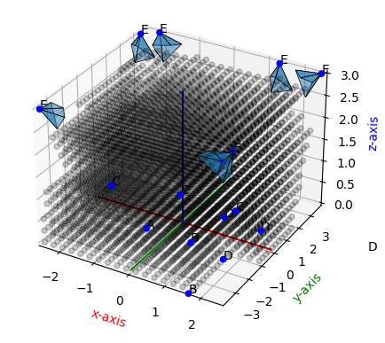

# Optitrack Optimizer
This project aims to optimize the placement of cameras for an Optitrack motion capture system. The non-linear optimizer used follows the CMA-ES algorithm. The implementation is from the python [cma](https://github.com/CMA-ES/pycma) library.
More information in documentation.pdf

# Example code
The main.py file contains and example code that more-or-less goes through all capability of the entire project.
Due to the random nature of both the initial solution and the CMA-ES algorithm, you will probably not get the same exact result after the optimization step.

    

